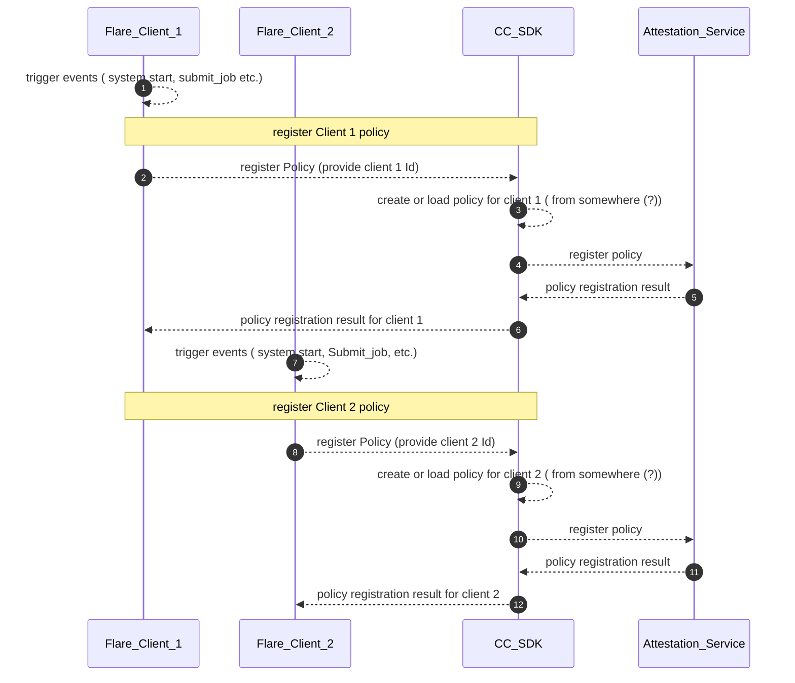
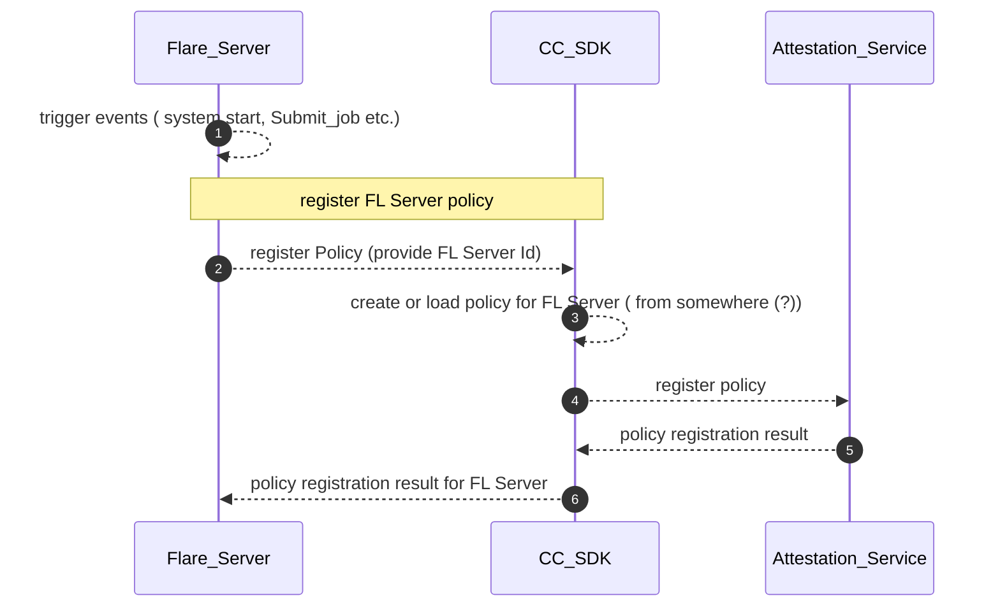
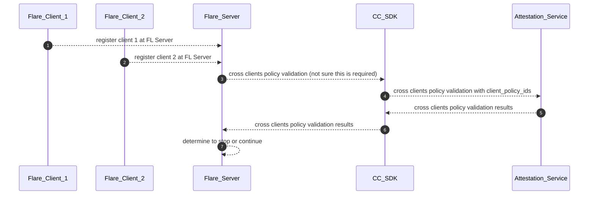
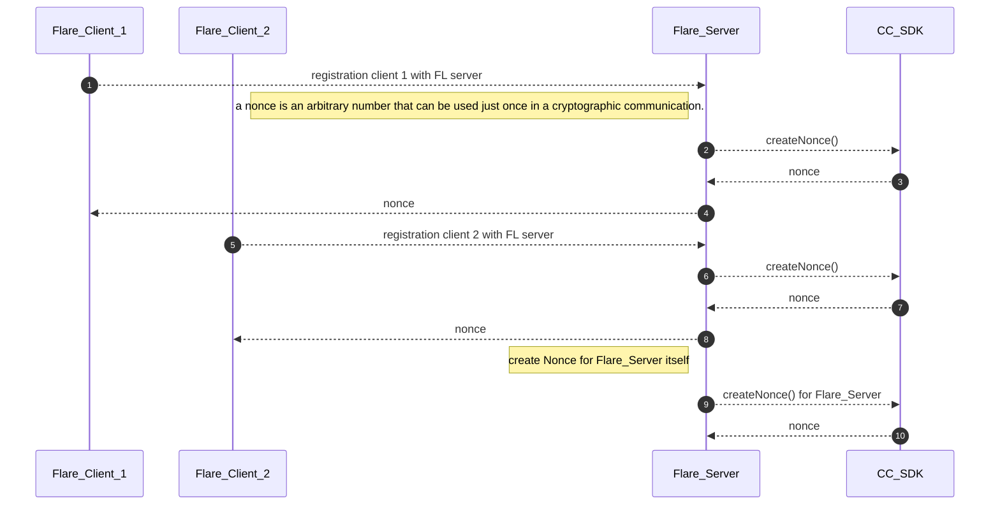
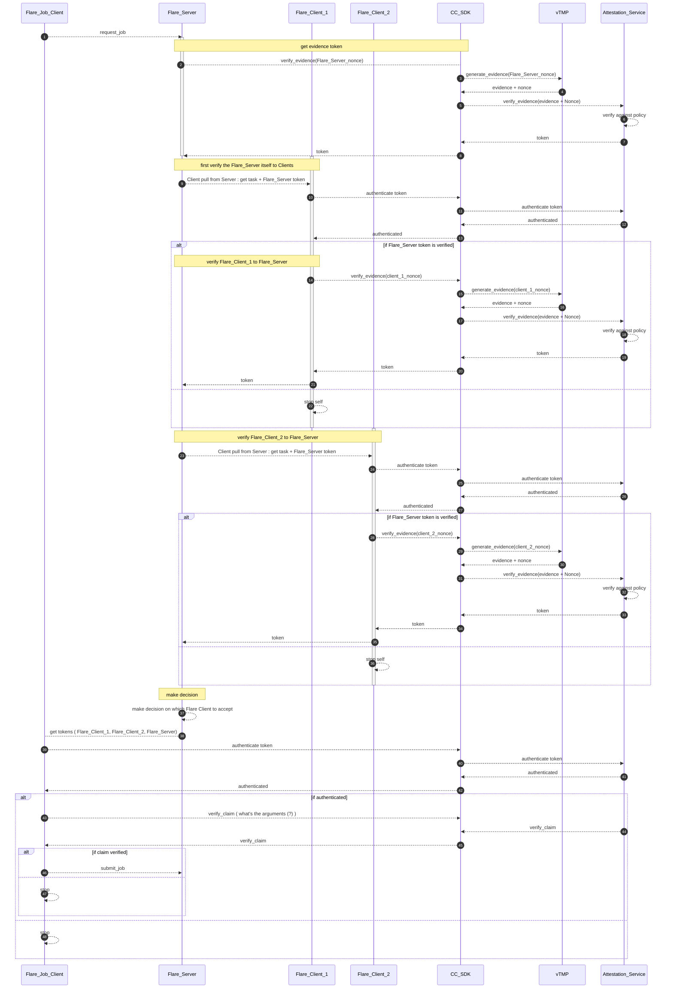

# FLARE, CC SDK, Attestation Service Interaction

## Preparation
* Question
    * do we need to register two type of policies:
        1) what policy that this device will accept ? 
        2) what policy ( claim(?) ) that this device has ?
      
### Preparation Actions: Client register policy

### Preparation Actions: FL Server register policy

### Preparation Actions: Cross Clients policy validation -- required (?)

## Local Attestation

### Local Attestation: register devices (FL Clients and FL Server)

### Local Attestation: verify evidence & policy enforcement

