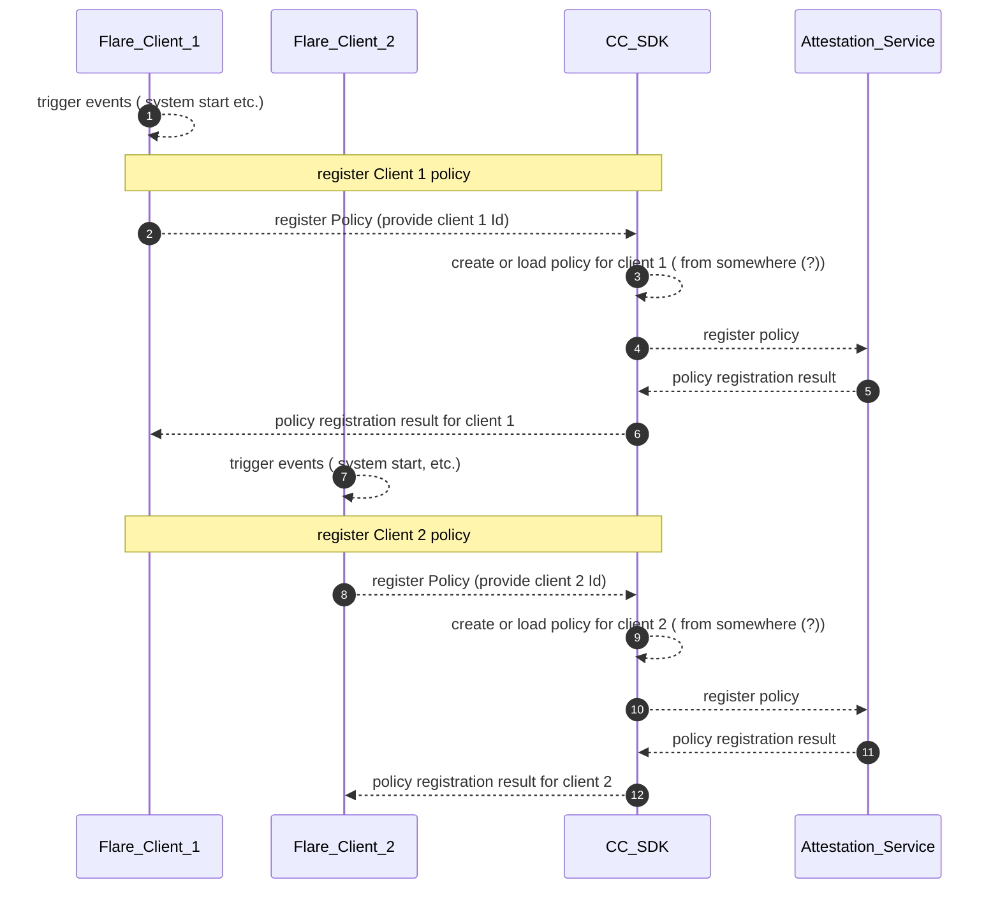
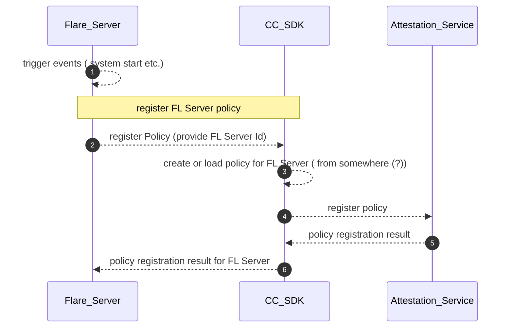
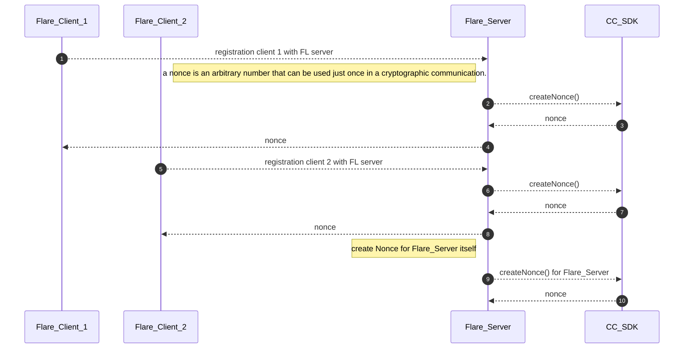
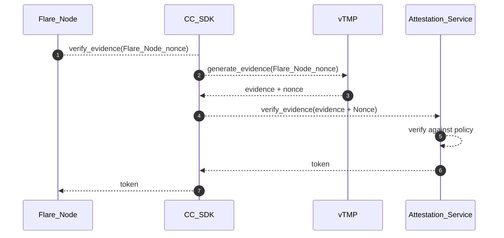
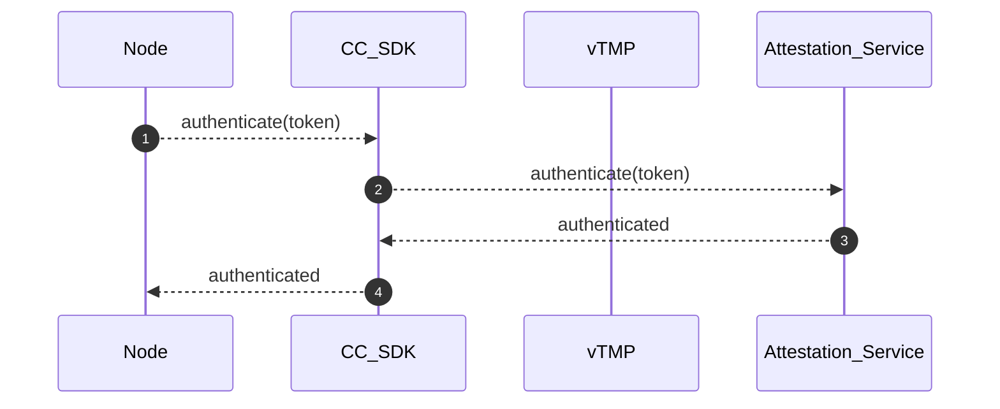
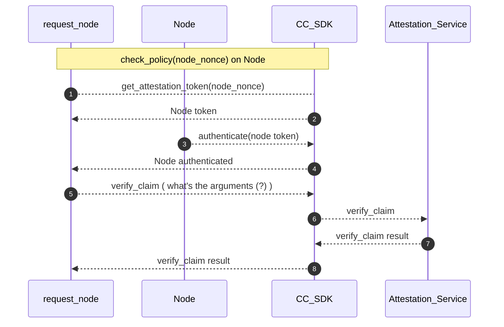
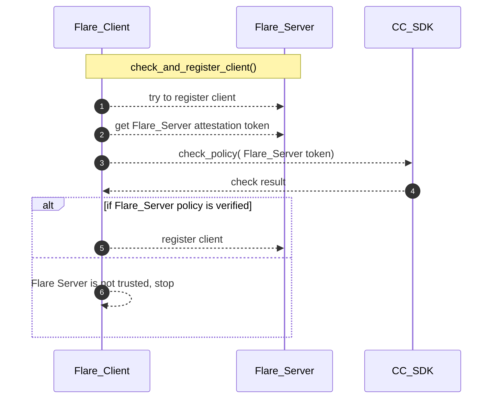
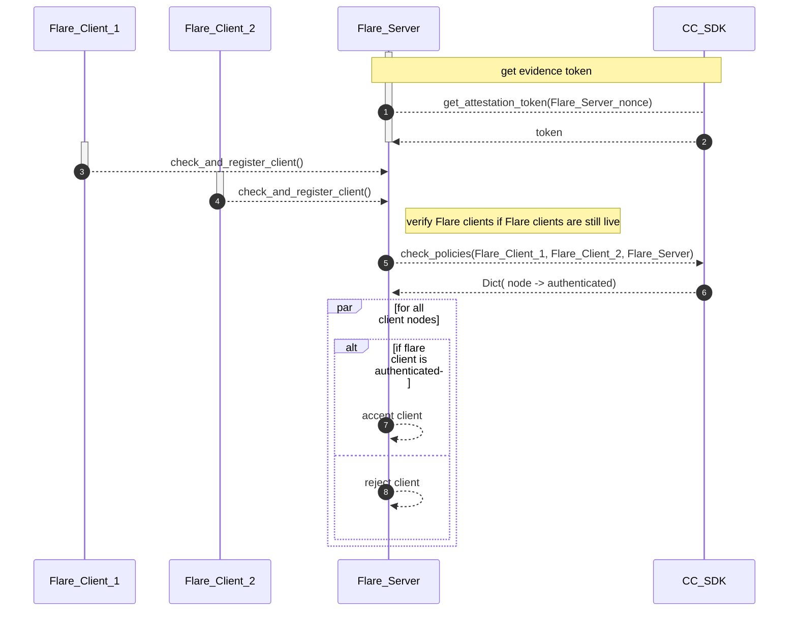
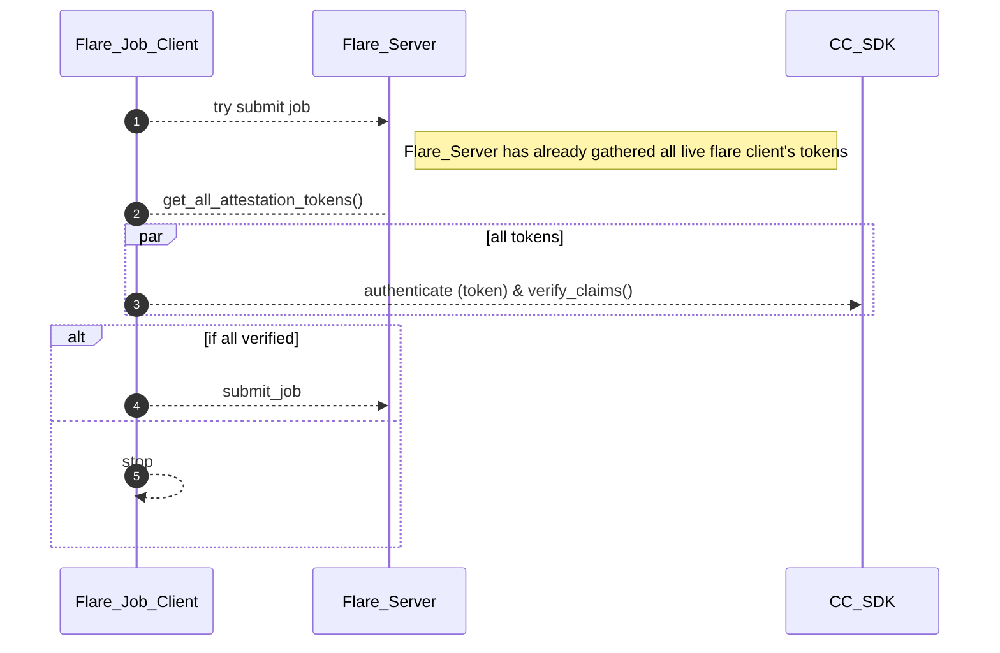

# FLARE, CC SDK, Attestation Service Interaction

## Preparation
* Question
    * do we need to register two type of policies:
        1) what policy that this device will accept ? 
        2) what policy ( claim(?) ) that this device has ?
      
### Preparation Actions: Client register policy

### Preparation Actions: FL Server register policy

## Local Attestation

### Use Cases
There are following use cases in consideration
* Flare Client Node needs to make sure the Flare Server is trust worthy
* Flare Server Node needs to make sure the Flare Client Nodes are trust worthy
* Flare Console Node ( aka Job Client Node) needs to make sure all Flare Server and Flare Clients are trust worthy
* Flare Client Node needs to make sure other Flare Client nodes are trust worthy, For those Nodes, the Client's job will be deployed (via Flare Server Node) to them.

### Open questions
* if the Flare Server is trusty to Flare Client 1, and Node 1, Node 2 are trust worthy to Flare Server,  can the Flare Client 1 considered Node 1 and Node 2 are also trust worthy ? 
  in other words, is the trust transitive ? 
* The Attestation Service returned token, is it safe to be shared ?  for example,  Flare Server received attestation token from Flare Client 1, is it ok to pass the Flare Client 1 token to Flare Client 2.  

### Local Attestation: register devices (FL Clients and FL Server)

### Local Attestation: verify evidence & policy enforcement

* Node get attestation token

* Node : authenticate(token)

* Check/enforce Policy on Node

* Flare Client checks if Flare Server is trust worthy

* Flare Server checks if Flare Clients are trust worthy

* Flare Console ( Job Client ) check if Fare Server, Clients are trust worthy

* Flare Client 1 check if the other FL Clients the job code will be deployed to are trust worthy

  * approach one, Flare Client 1 as Flare Server to do it on behalf of Flare Client 1, is this allowed ? 
  * approach two, Flare Server sends all clients' tokens to Flare Client 1. Flare Client 1 ask CC SDK to check for all the clients. Is token sharable ? 

