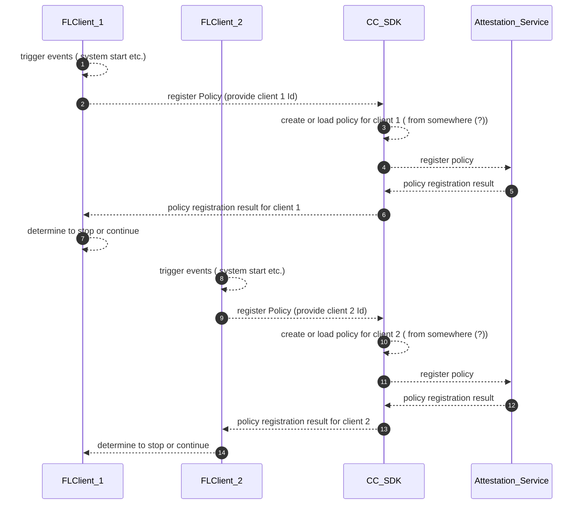
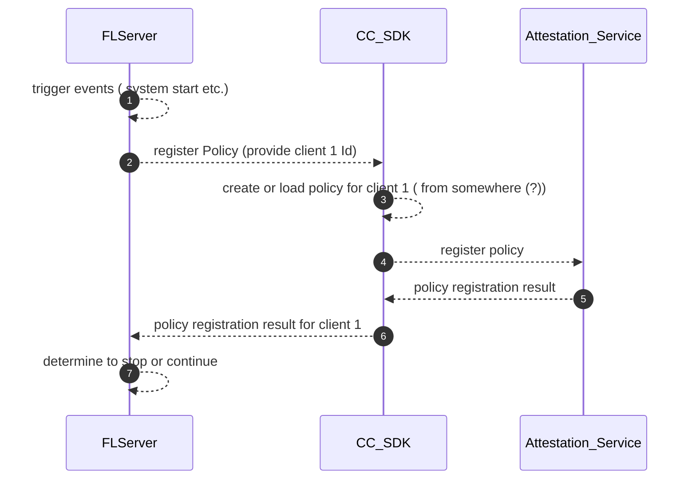
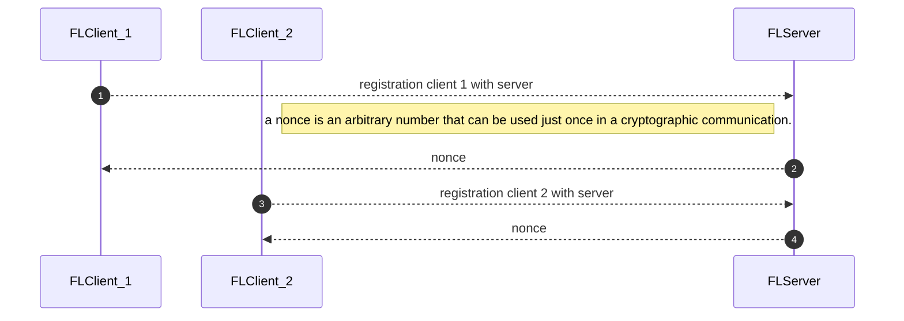

# FLARE, CC SDK, Attestation Service Interaction

## Preparation

### Preparation Actions: Client register policy

### Preparation Actions: Client register policy

### Preparation Actions: Cross Clients policy validation -- required (?)

## Local Attestation

### Preparation Actions: FL Clients and FL Server -- orchestration

