# Basic CC Sequence Diagrams

## Preparation
* Question
    * do we need to register two types of policies:
        1) what policy that this device will accept ? 
        2) what policy ( claim(?) ) that this device has ?
      
### Preparation Actions: register_policy()

* We use FL Server, FL Client to indicate the Client nodes and Server in Federated Computing setting
* For non-High Availability Case, FLARE will have one (1) FL server + Many (N) FL Clients
* For High Availability Case, FLARE will have two (2) FL server + One (1) overseer + Many (N) FL Clients
* Node here represent individual node (FL Server, FL Client, FL Overseer, FL job Client)

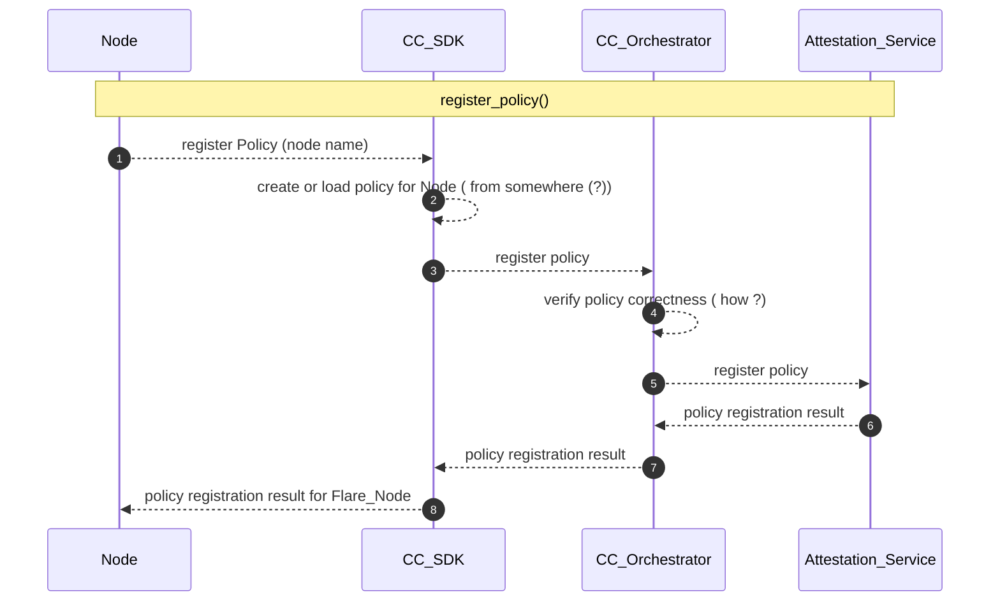
 
## Local Attestation

Every Node needs to attest for itself.

### Local Attestation

* Node registration_node()

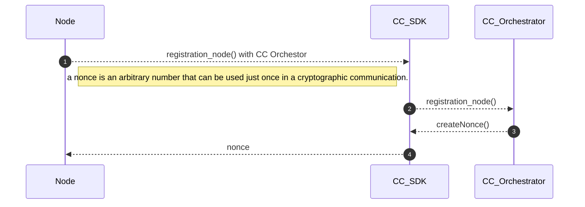

* Node verify_evidence()

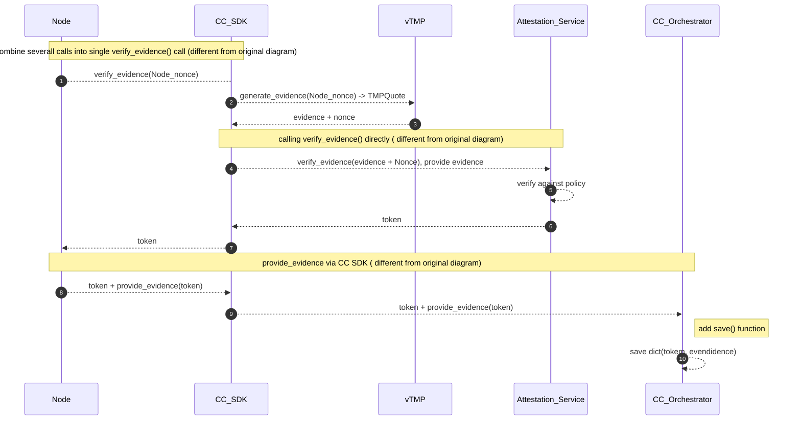


## Enforce Policy

### check_authentication( participant token)
 
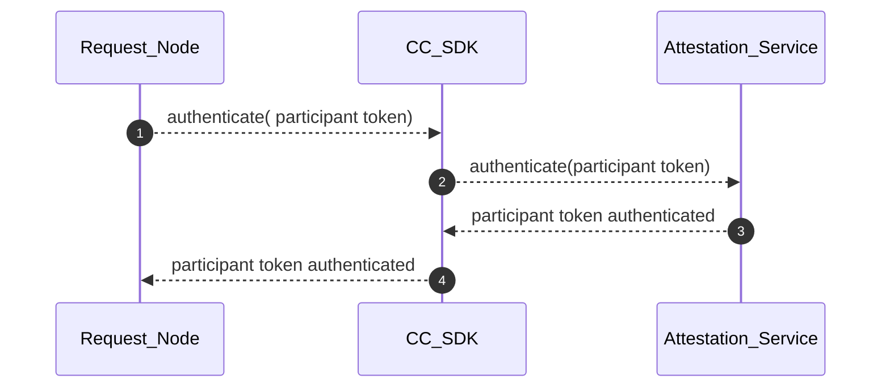

### enforce policy: enforce_policy()

```mermaid
sequenceDiagram
   autonumber
    
    participant Node
    participant CC_SDK
    participant CC_Orchestrator
        
    Node -->> CC_SDK : send_token_to_orchestrator(node attestation token)
    CC_SDK -->> CC_Orchestrator:  send_token_to_orchestrator(node's attestation token)
    Node -->> CC_SDK : get_participant_tokens() from CC orchestrator
    CC_SDK -->> CC_Orchestrator : get_participant_tokens()
    CC_Orchestrator -->> CC_SDK : participant tokens 
    CC_SDK -->> Node :  participant tokens 
    loop all participant tokens
        Node -->> CC_SDK : check_authentication(participate token) (details omitted) -- check participant token authenticity
        CC_SDK -->> Node : authentication result
        alt if authenticated
            Node -->>  CC_SDK: verify_claim  ( what's the arguments (?) )
            CC_SDK -->> Attestation_Service : verify_claim
            Attestation_Service -->> CC_SDK : verify_claim result
            CC_SDK -->> Node : verify_claim result
    end
    Node -->> Node : make decision for participants
```

# FLARE system preparation, local attestation and policy enforcement

with above basic diagrams, now we apply above to Flare System.

#### Assumptions
* CC Orchestrator will be hosted by FL Server's Node
* communication between CC SDK and CC Orchestrator is considered trust worthy
* Flare Job Client = Flare Console Node, or node running Flare Notebook

## Flare nodes prepare
* based on system start event or initial handshake ( in case of notebook admin API runner)

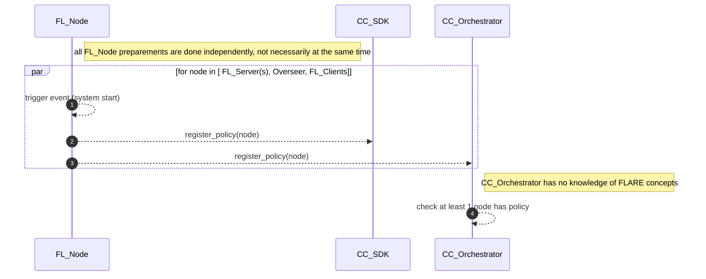

## Flare nodes local attestation

### system start event

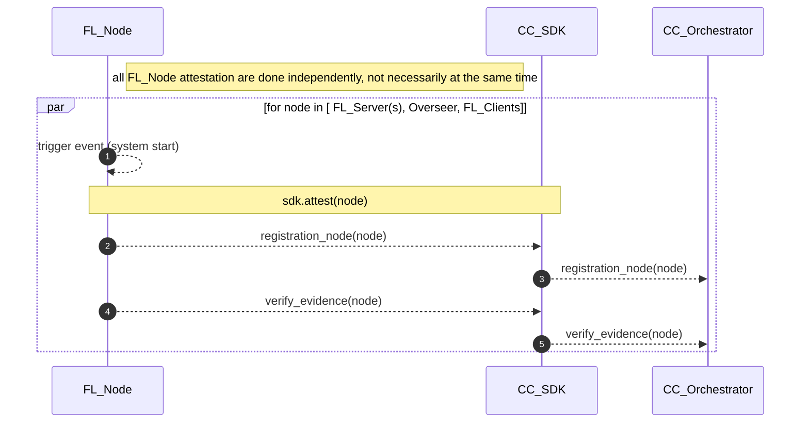

### submit job event


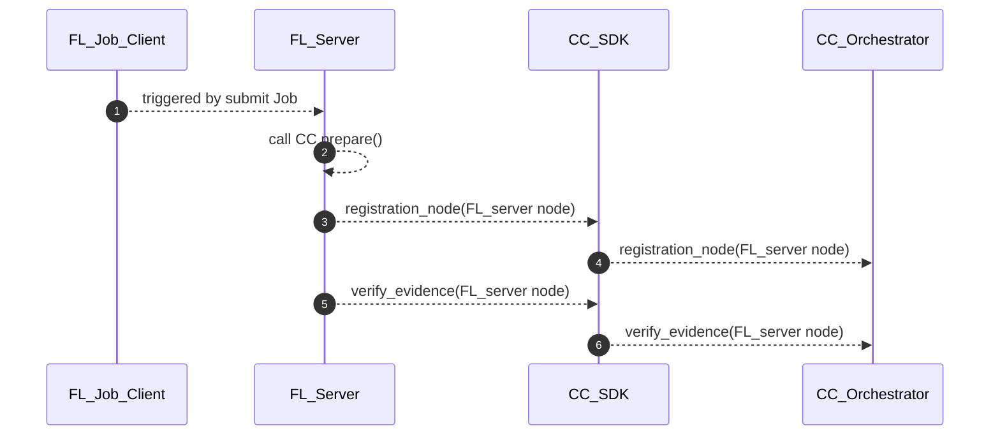

### connect to Oversee event

#### Flare Job Client = Flare Console Node, or node running Flare Notebook

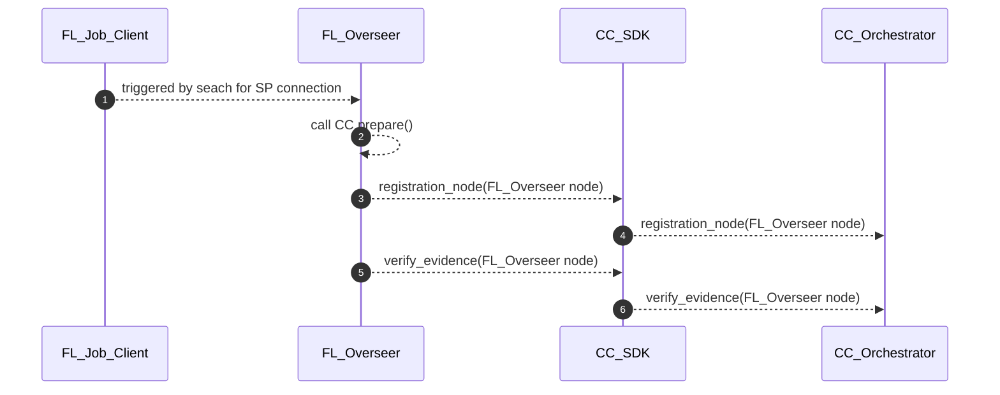

### FL Server deploy app to clients event
 
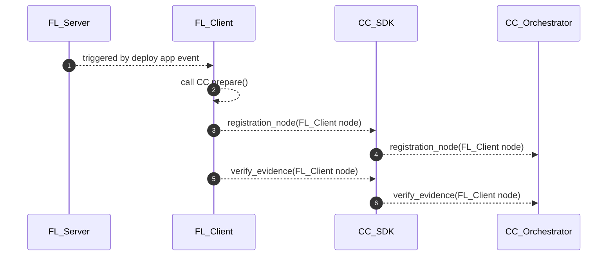


## Flare nodes policy enforcements

#### Use Cases
There are following use cases in consideration
* Flare Server Node needs to make sure all participants are trust worthy, i.e Overseer, All FL Clients
* Flare Client Node needs to make sure all participants are trust worthy, i.e FL Server1,2, Overseer, other FL Clients
* Flare Job Client needs to make sure all FL Servers, overseer and all FL Clients are trust worthy
 
### Use Case 1: **Flare Server** Node needs to make sure all participants are trust worthy, i.e Overseer, All FL Clients

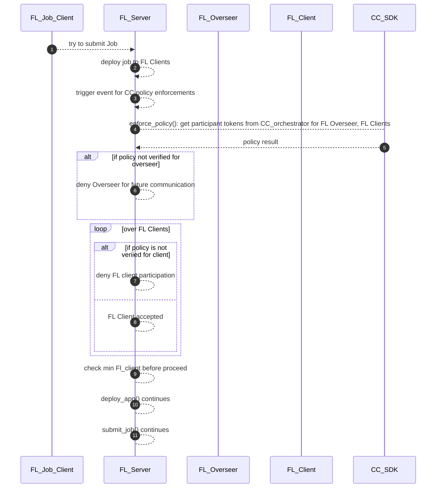

 
### Use Case 2: **Flare Client** node needs to make sure all participants are trust worthy, i.e FL Server(s), Overseer, other FL Clients

* get task() event

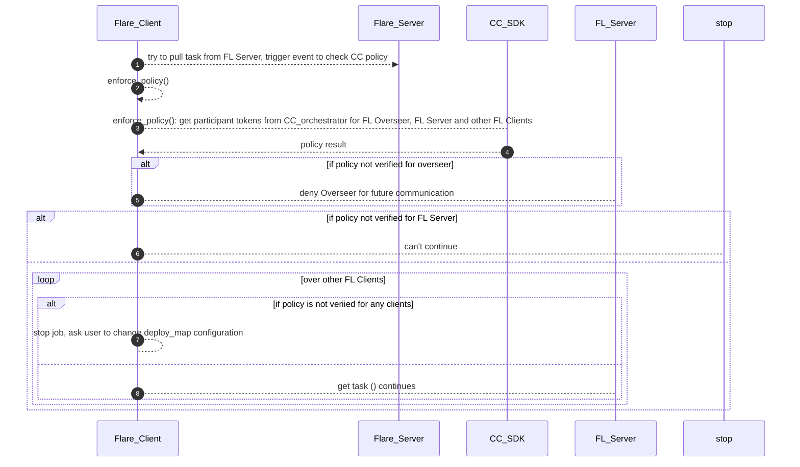

### Use Case 3: Flare Job Client needs to make sure all FL Servers, overseer and all FL Clients are trust worthy

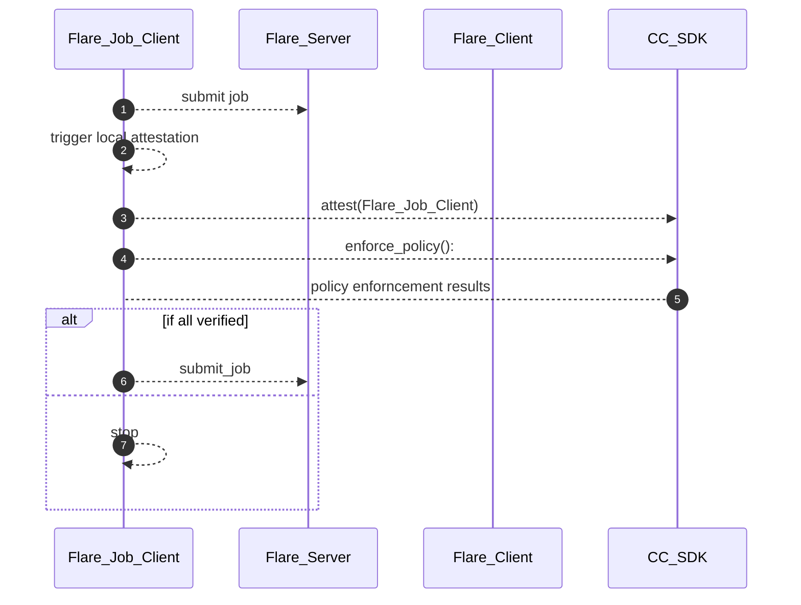
 