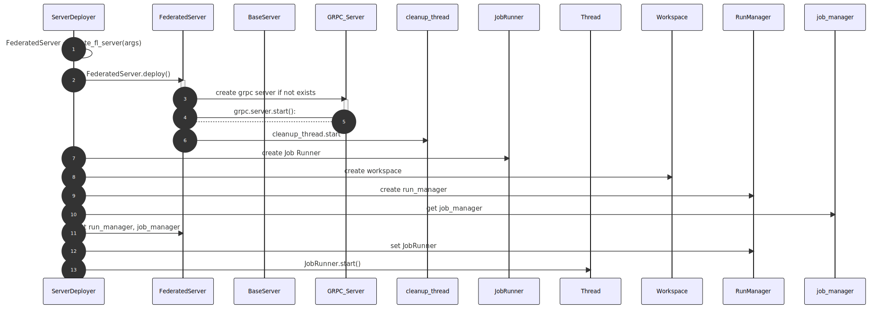
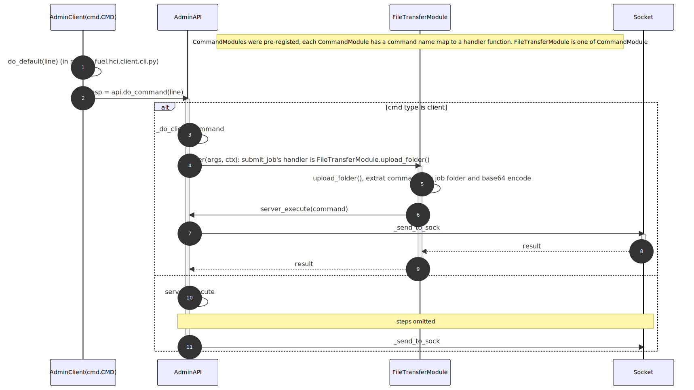
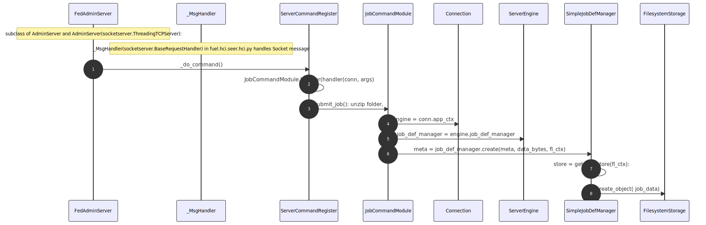
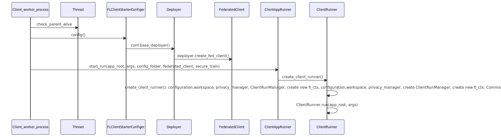

# NVFLARE CLIENT SERVER STATE

## FL Server

### FL Server Start State

### FL Server Stop State

## FL CLIENT 

### FL Client Start 

### FL Client Stop

Todo

## FL Server: Server Start

## FL Server: ServerDeployer.deploy()

# JOB Workflow

## Submit Job: Admin Client

## Submit Job: Server Side

## Dispatch Job: JobRunner.run()
 * check, schedule and run jobs

# Run Job: JobRunner._start_run()
* run job

## FL Server: Federated Server Process

## FL Server: Job Child Process

## FL Client Job Process

## FL Client Job Worker Process

## ClientRuner.run()

## ClientRunner.fetch_and_run_one_task()

## ClientRunner._process_task()
