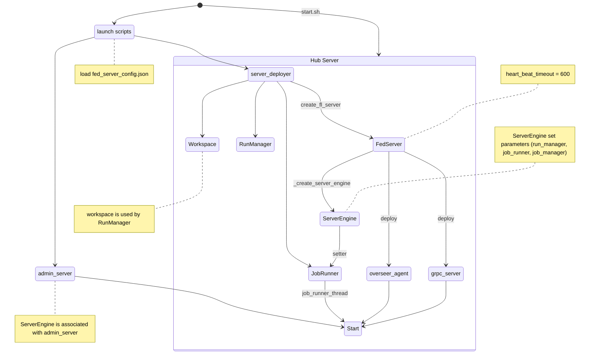
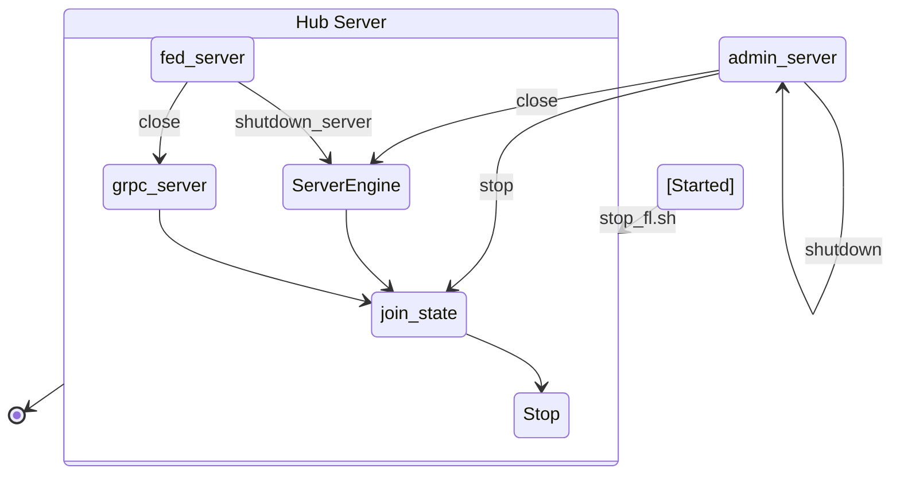
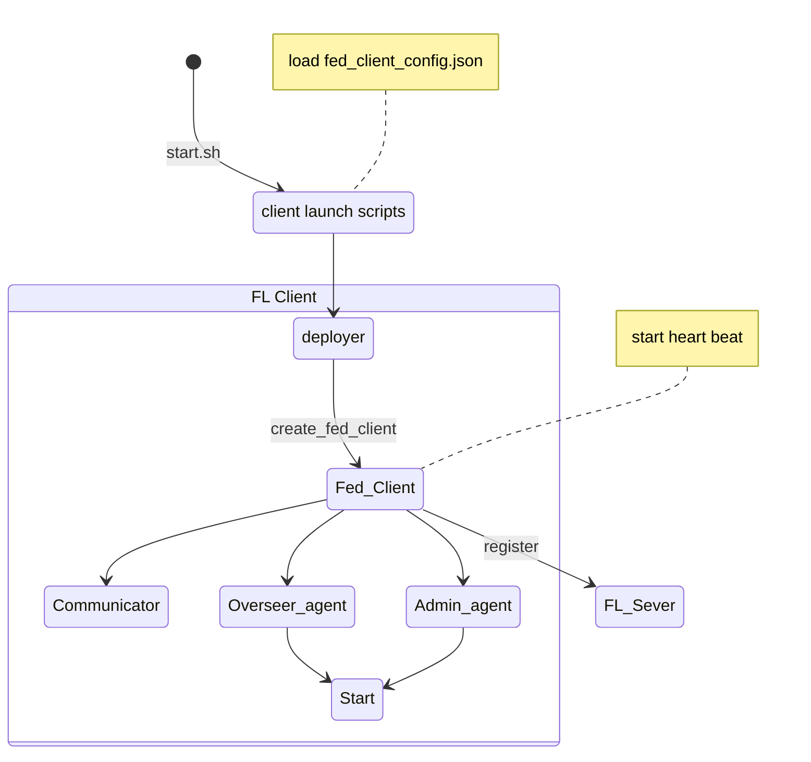

# NVFLARE CLIENT SERVER STATE

## FL Server

### FL Server Start State

```mermaid
stateDiagram-v2
    Hub_Server: Hub Server
    [*] --> Hub_Server: start.sh
    server_train: launch scripts
    [*] --> server_train
    note right of server_train
        load fed_server_config.json
    end note
    server_train --> server_deployer
    server_train --> admin_server
    admin_server --> Start
    note right of admin_server
       ServerEngine is associated with admin_server
    end note
                  
    state Hub_Server {
        server_deployer --> FedServer : create_fl_server    
        note left of FedServer
            heart_beat_timeout = 600
        end note
        server_deployer --> JobRunner
        server_deployer --> RunManager
        server_deployer --> Workspace
        note right of Workspace
            workspace is used by RunManager
        end note
        
        FedServer --> ServerEngine:_create_server_engine
        FedServer --> grpc_server: deploy
        FedServer --> overseer_agent: deploy
        note left of ServerEngine
               ServerEngine set parameters (run_manager, job_runner, job_manager)
        end note
        ServerEngine --> JobRunner:setter
        JobRunner --> Start: job_runner_thread
        overseer_agent --> Start
        grpc_server --> Start
   
       
    }
```

### FL Server Stop State

```mermaid
stateDiagram-v2
    Hub_Server: Hub Server
    [Started] --> Hub_Server: stop_fl.sh
    admin_server --> admin_server: shutdown
    admin_server --> join_state: stop
    admin_server --> ServerEngine: close
    state Hub_Server {
        state join_state <<join>>
        grpc_server --> join_state 
        fed_server --> ServerEngine:shutdown_server
        fed_server --> grpc_server:close
        ServerEngine --> join_state 
        join_state --> Stop    
       
    }
    Hub_Server --> [*]
```
## FL CLIENT 

### FL Client Start 

```mermaid
stateDiagram-v2
    FL_Client: FL Client
    Client_train: client launch scripts
    [*] --> Client_train: start.sh
    note left of Client_train
        load fed_client_config.json
    end note
    Client_train --> deployer
    Fed_Client --> FL_Sever: register 
    state FL_Client {
        deployer --> Fed_Client: create_fed_client
        Fed_Client --> Communicator
        Fed_Client --> Overseer_agent
        note left of Fed_Client
            start heart beat
        end note
        Fed_Client --> Admin_agent
        Overseer_agent --> Start
        Admin_agent --> Start
    }
```