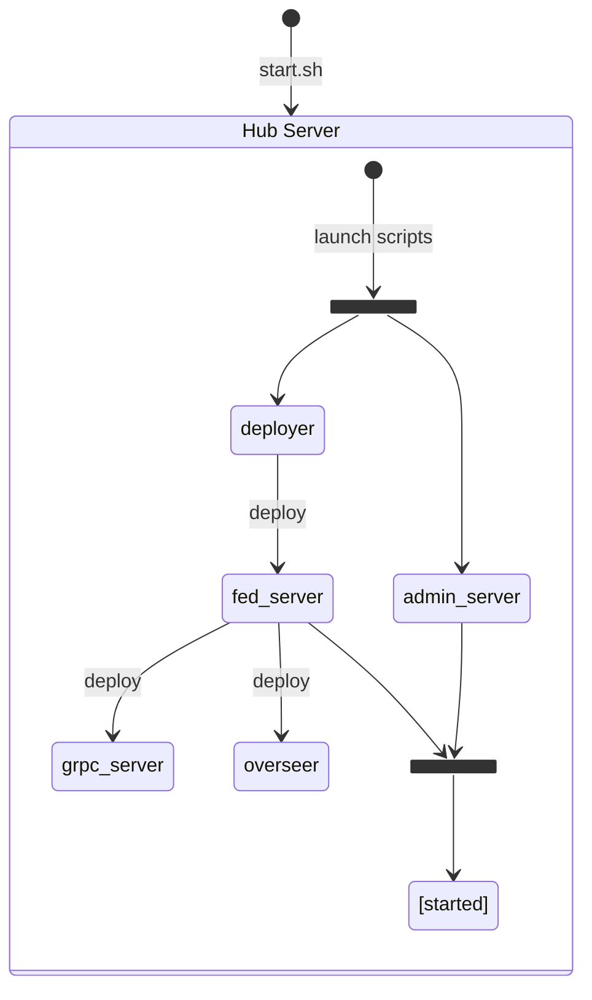
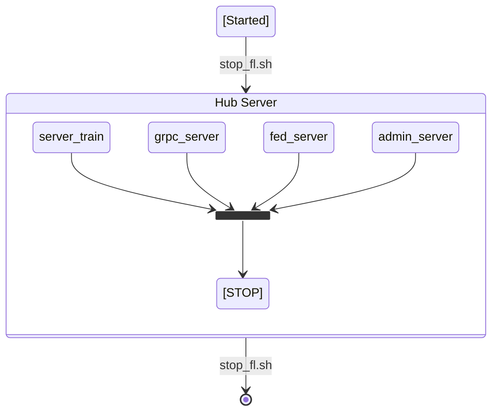
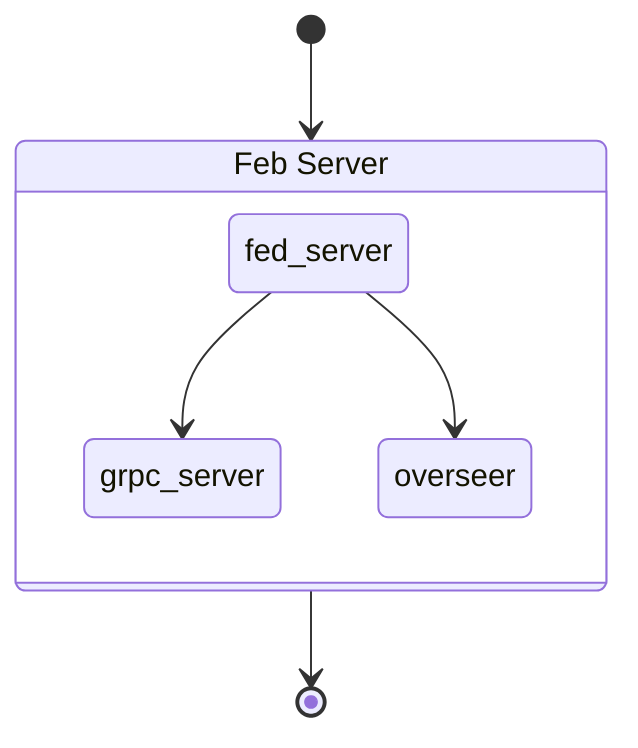
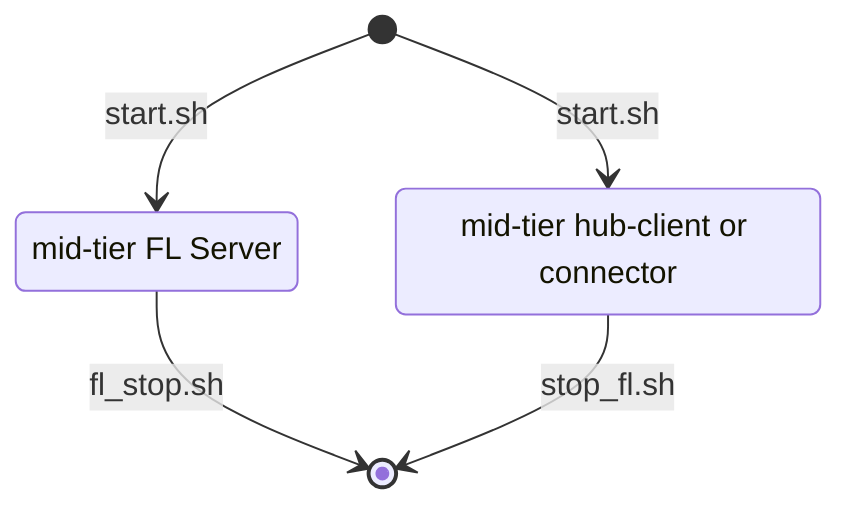
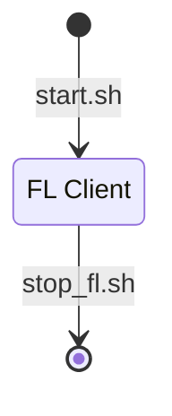

## Hub Server

### Hub Server Start State

```mermaid
stateDiagram-v2
    Hub_Server: Hub Server
    [*] --> Hub_Server: start.sh 
    state Hub_Server {
        state server_train <<fork>>
        [*] --> server_train: launch scripts                         
        server_train --> deployer
        deployer --> fed_server : deploy
        fed_server --> grpc_server : deploy
        fed_server --> overseer : deploy
        server_train --> admin_server
        
        state join_state <<join>>
        fed_server --> join_state 
        admin_server --> join_state
        join_state --> [started]    
       
    }
```

### Hub Server Stop State

```mermaid
stateDiagram-v2
    Hub_Server: Hub Server
    [Started] --> Hub_Server: stop_fl.sh

    state Hub_Server {
        state join_state <<join>>
        server_train --> join_state
        grpc_server --> join_state 
        fed_server --> join_state 
        admin_server --> join_state
        join_state --> [STOP]    
       
    }
    Hub_Server --> [*]:stop_fl.sh
```

### Feb Server

```mermaid
stateDiagram-v2
    Fed_Server: Feb Server
    [*] --> Fed_Server 
    state Fed_Server {
        fed_server --> grpc_server 
        fed_server --> overseer
         
   
    }
    Fed_Server --> [*]     

```
## MID-TIER SERER & CONNECTOR

```mermaid
stateDiagram-v2
    FL_Server: mid-tier FL Server
    Hub_Connector: mid-tier hub-client or connector
    
    [*] --> FL_Server: start.sh 
    [*] --> Hub_Connector: start.sh 
    
    FL_Server --> [*]:fl_stop.sh
    Hub_Connector --> [*]:stop_fl.sh
```

```mermaid
stateDiagram-v2
    FL_Client: FL Client
    [*] --> FL_Client: start.sh 
    FL_Client --> [*]:stop_fl.sh
```