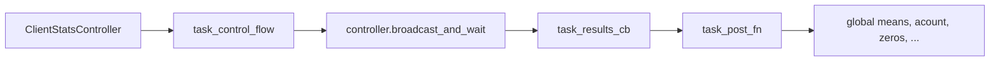
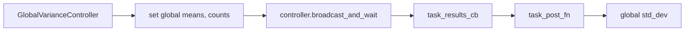
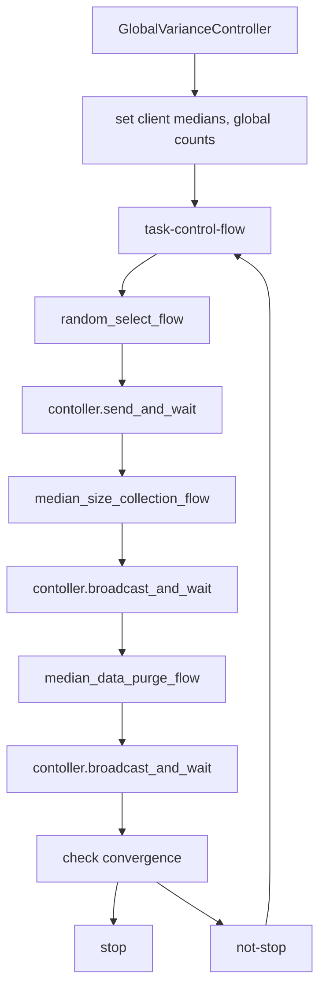

# Federated Statistics

## Project Goals

### Long term goal: 
    able to have a python module that can be imported so that one can something like the followings
``` python
    from federated_statistics import FederatedStatisticsGenerator
    
    dfs = { "site1": df1. "site2", df2}
    gen = FederatedStatisticsGenerartor()
    stats = gen.generate_statistics(dfs, fl_ctx)
    save_to_file(stats, fl_ctx)
    
```

stats will have statistics including df1, df2 and global stats. The resulting file can then  be loaded
into for visualization. The generate_statistics will run in NVFLARE federated setting. 

### Short term goal:
Be able to create an algorithm using NVFLARE FL Server Controller and FL Client Executor to generate the resulting file

### Description:
 Given any set of pandas dataframe consists of 
  * numeric data
  * datetime or deltadatetime  ( treated as numeric)
  * categorical data 
  * structure data ( array of simple data type)

  We sould be able to generate statistics for each client, and for aggregate statistics. 

  For **numeric data**, the statistics include
  + max
  + min
  + mean
  + median
  + std_dev
  + number of missing
  + count
  + number of zeros
  + standard histogram
  + quantile histogram

  For **Categorical data**, the statistics include
  + number of missing
  + count
  + unique numbers of strings
  + top values ( based on frequency)
  + average string length
  + top N level standard histograms
  + string length histograms

## Approaches

We will leverage the Google's [Facets-Overview](https://pair-code.github.io/facets/) project.
In Facets-overview project, Google defined the Statistics definition in
[protobuf](https://github.com/PAIR-code/facets/blob/master/facets_overview/proto/feature_statistics.proto),
they then implemented two variances: one in [python](https://github.com/PAIR-code/facets/tree/master/facets_overview/python)
another in Javascripts.

With this project, Google further build [what if Tools] (https://pair-code.github.io/what-if-tool/). And they embedded
in machine learning frameworks such as TFX. For example in Tensorflow Data Validation (TFDV), one can 
do the followings
```
    stats = tfdv.generate_statistics_from_tfrecord(data_location=path)
```
The returned value is a DatasetFeatureStatisticsList protocol buffer.
The example notebook contains a visualization of the statistics using Facets Overview:
```
    tfdv.visualize_statistics(stats)
```
this will display visualization on Jupyter notebook.

The Google's work is not designed for distributed system and for small set of data. GoPro ( actually me) created 
an Open Source project called [Facets-overview-spark](https://github.com/gopro/facets-overview-spark)

```scala
  val train = trainData.toDF(features: _*)
  val test = testData.toDF(features: _*)
  
  val dataframes = List(NamedDataFrame(name = "train", train), NamedDataFrame(name = "test", test))
  val generator = new FeatureStatsGenerator(DatasetFeatureStatisticsList())
  val proto = generator.protoFromDataFrames(dataframes)

```

I would like I can do something similar for NVFLARE. In order to do this, we have to re-implemented the python version, 
due to the following concerns

* histogram calculations requires all the buckets (client and global) to have the same edges in the bin/bucket, where the original implementation has no such consideration
* number of bins are hard-coded to 10, we would like to give client more control
* In Federated Statistics, we need to turn off some of the value display due to data privacy
* Protobuf object serialization seems to be not easy to transfer between FL server and Clients. 


Steps
1) Re-implemented the Facets-overview statistics in python native class (without protobuf)
2) Controller can calculate global statistics based on client's statistics.
3) Some global statistics may require more than one round of calculations
4) Controller finally assemble global and clients' statistics and generate protobuf 


## Details

### Global Numeric Stats Algorithms
+ Mean, Count, Zeros, Missing ==> additive
+ std_dev ^2 = variance = Sum ( Xi - global_mean )/ N -1  where N = total_count
  + we can calculate the global mean from 1st round, then pass the global means to all clients to 
  + calculate the variance for each client. and add them together
+ median ==>  
  + random select one server, and random number 
  + split dataset into  xi >= p and Xi < p datasets, 
  + reporting the sum of sizes of xi >= p, called m  and compare with K = N/2
  + if m > k, discard the less than dataset
  + if size is smaller, k = k - m, and discard great then dataset
  + repeat
  + converge criteria
    + geeater dataset or less than dataset is about 50% 
* Standard Histogram calculations
  * take the global min and max value,
  * send to all clients 
  * calculate standard histogram for range = (global_min, global_max) for all clients
  * add standard histogram values
* Quantile Histogram Calculations
  * Each bucket is equal percentage (such as 10%)
  * simply add each bucket value

### Task Controllers

+ Client Statistics Calculation 

 + Global Variance Calculation



+ Global Median Calculation



+ Global numerics Histograms Calculation


    


