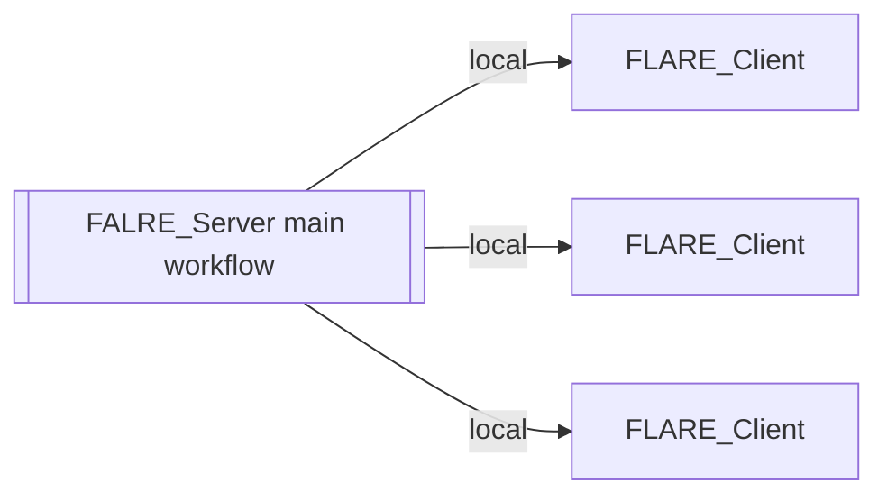
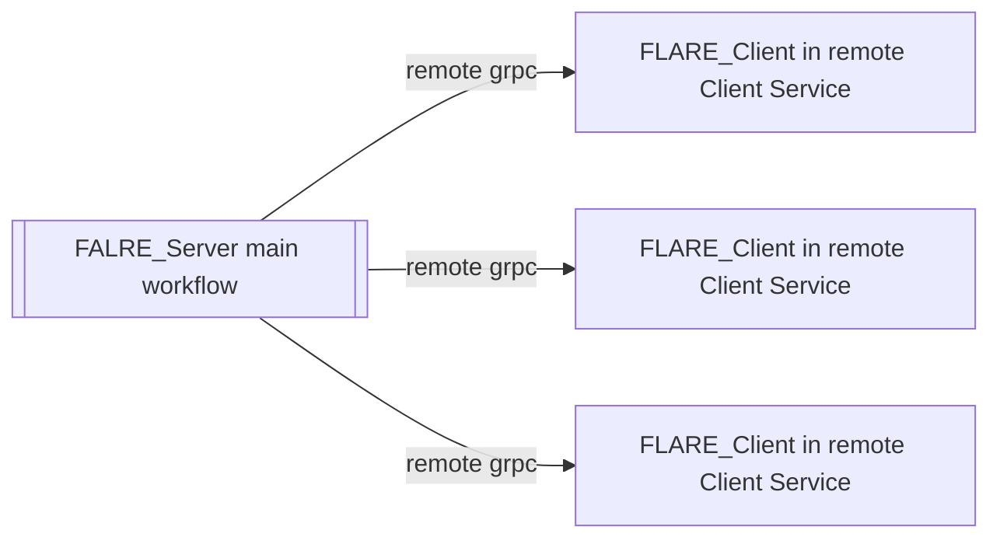
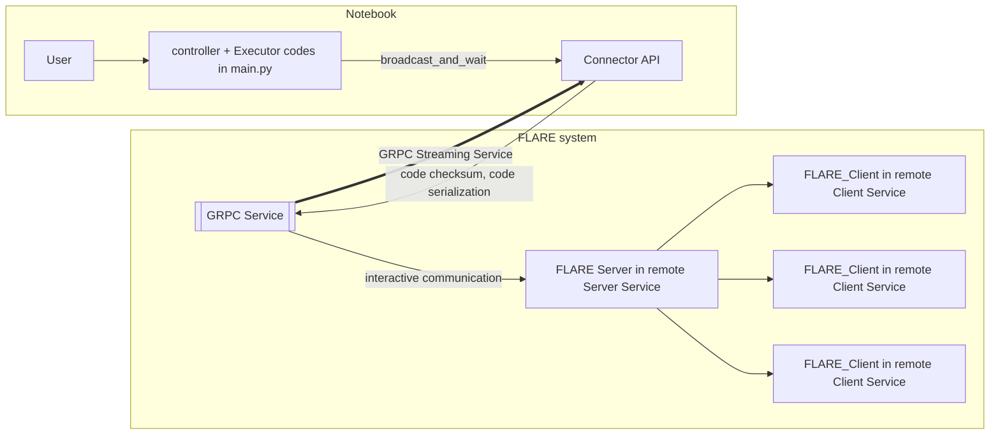
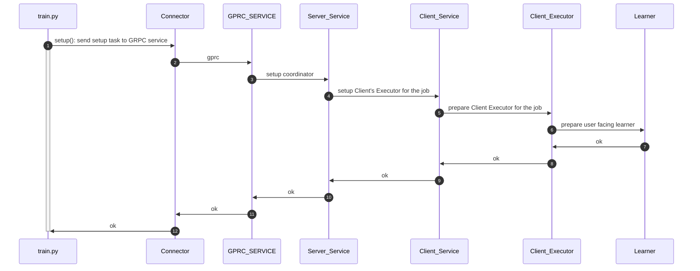
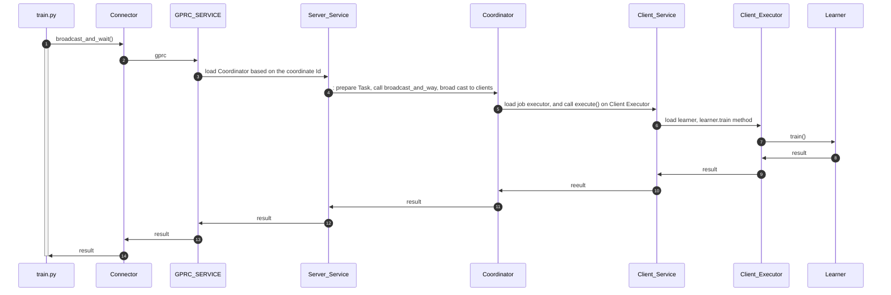
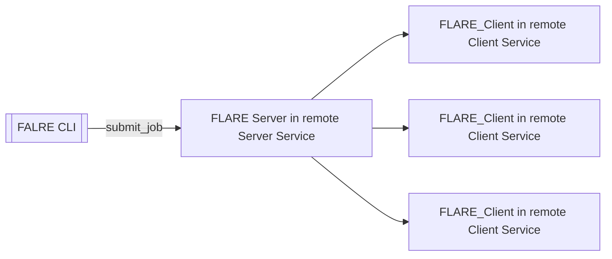

# Socket Programming in Python (Guide)

# Usage Pattern One: 
 FLARE SERVER as Lib, FLARE Client is locally simulated.
 This can be used in interactive Python, Python Notebooks

# Usage Pattern Two: 
 FLARE SERVER as Lib, This can be used in interactive Python, Python Notebooks
 FLARE Client will run in remote FLARE Client Service. 
 Tasks
 * Simple FLARE Server Lib with GRPC communication 
 * Key communication points: broadcast (grpc interactions)
 * Main Program is Controller Workflow code
 * broadcast will 
   * serialize sharable, meta info and client code into exec_unit_package  
   * send exec_unit_package to remote client-service, then trigger client run
 * listen to registered event for reply
   * handle reply
   * **Note**  This is like Apache Spark Master vs. Executors
   * The issue with this deploy pattern is The User interaction piece is tie to direct to FLARE Server Implementation
   
Cons: 
   Heavy Client (similar to Apache Spark Driver)
   User experience is strong coupled with each server logics

# Deploy Pattern Three: 
 FLARE SERVER as Service 
 FLARE Client as Service 
 User interact with Flare Connect API 
 * Similar to current NVFLARE but different
 * Admin API is replaced with Connect API
 * Similar to Apache Spark Connect API patterns
 * Separate Flare Controller changes from the FLARE Connect APIs

### Setup()

### broadcast_and_wait()

# Usage Pattern Four:
FLARE SERVER as Service
FLARE Client as Service
Sub are submitted via Flare CLI submit_job
Different from today:
* Server Workflow Controller Configuration is defined via python
* Client Executor Configuration is defined via python
* This almost identify to FLARE current deployment pattern.
* Where CLI part is Admin Console

